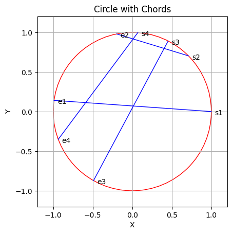
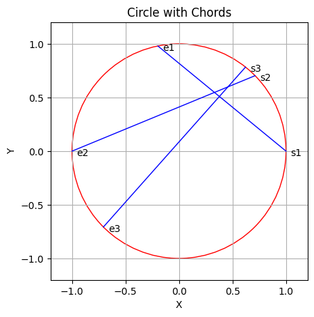
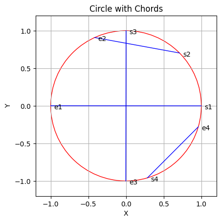
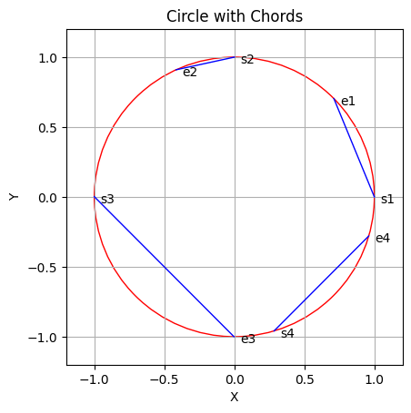

# Total number of intersections between chords

This project is part of an assessment. The problem statement can be found [here](https://docs.google.com/document/d/1BzpdFaeWode6TjZz420oCwRYcALy5AKApFVPe0iVE-I/edit).

## Visualizing the Circle and Chords

To better understand the problem and the brute force approach, visualization is a helpful tool. The provided `plot_circle_and_chords` function in the code generates a plot of the circle with chords. This visualization aids in grasping the geometric representation of the problem.





## Brute Force Approach

The initial approach to solving the problem involves a brute force method. In this approach, the algorithm linearly iterates through the list of chords and checks for intersections with all subsequent chords. For each pair of chords, it evaluates the intersection condition, leading to a time complexity of O(n^2).

### logic for intersection condition:

For two chords, let's denote them as chord_1 and chord_2:

- Let (s1, e1) be the coordinates for chord_1.
- Let (s2, e2) be the coordinates for chord_2.

There will be an intersection if:
- s2 lies within the interval (s1, e1)
- e2 > e1
  
# Optimized Approach

The optimized approach takes advantage of the sorted nature of the input data. By utilizing a `SortedSet` data structure, the algorithm achieves a more efficient time complexity of O(n log n). The `SortedSet` allows quick insertion, deletion, and search operations, optimizing the intersection counting process.

### Algorithm Steps:

1. Initialize an empty `SortedSet` to track active chords.
2. Iterate through the sorted list of angles and identifiers.
3. If an element is a starting point "s_x", add it to the `SortedSet`.
4. If an element is an ending point "e_x", find how many elements are bigger than the target (label) using binary search in the `SortedSet`, then delete that count of starting points "s_x".
   - Modify the binary search to return the count of elements greater than the target (label) rather than searching for a specific value.
   - This modification is crucial for optimizing the algorithm from O(n^2) to O(n log n).
5. Calculate intersections based on the count obtained from the modified binary search.
6. Remove the ending point "e_x" from the `SortedSet`.

## Time Complexity

The time complexity analysis is crucial for understanding the efficiency of the algorithm. The optimized approach's time complexity is O(n log n), a significant improvement over the brute force approach.

## Code Implementation - Jupyter Notebook

The code is implemented in a Jupyter Notebook for ease of understanding and execution. To run the code, ensure you have the required dependencies installed.
The solution can be found [here](https://colab.research.google.com/drive/1Lcx9t6w7WzT_HeLpFqmvsRUCgqveVnNY?usp=sharing).

### Dependencies

- SortedSet
- NumPy
- Matplotlib

### How to Install Dependencies

```bash
pip install SortedSet numpy matplotlib
